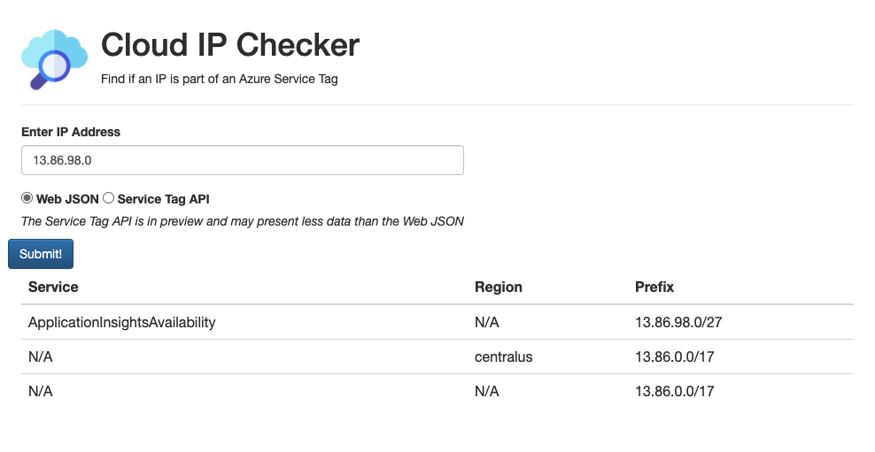

# Cloud IP Checker
This service will help you determine whether an IP address is within one of the Azure Service Tag network ranges. 

If it is found, it will provide you with the Azure Region and Azure Service that the IP address belongs to. 

This tool can be consumed in three different ways.

* API
* Web Frontend
* CLI tool

## API

### Using the API
The API is ready for you to use and is hosted in Azure. It takes an ip address as a query parameter of `ip`. This can be either IPv4 or IPv6. 

An example URI is: [https://cloudipchecker.azurewebsites.net/api/servicetags/manual?ip=13.86.98.0](https://cloudipchecker.azurewebsites.net/api/servicetags/manual?ip=13.86.98.0)

By default the API searches the downloaded [JSON file](https://www.microsoft.com/download/details.aspx?id=56519&WT.mc_id=devops-0000-debryen) that is available on the Azure Website to manually download. 

If you wish to query to [Azure Service Tag API](https://docs.microsoft.com/rest/api/virtualnetwork/servicetags/list?WT.mc_id=devops-0000-debryen) instead, then you will need to change the URI, replacing `manual` with `api`

An example URI for this is: [https://cloudipchecker.azurewebsites.net/api/servicetags/api?ip=13.86.98.0](https://cloudipchecker.azurewebsites.net/api/servicetags/api?ip=13.86.98.0)

>The reason for this is that as the Service Tag API is in preview, it does not include as much data as the JSON that you can manually download. So you may get inconsistent or unexpected results there. Therefore, I built support for both. As the Service Tag API goes GA, I will change the default to be the API instead. 

An example output of the API is as per below. 

>Sometimes you will receive both `Region` and `Service` but other times you will receive neither. 

```json
{
    "Status": 200,
    "Values": [
        {
            "Region": "",
            "Service": "ApplicationInsightsAvailability",
            "AddressPrefix": "13.86.98.0/27"
        },
        {
            "Region": "centralus",
            "Service": "",
            "AddressPrefix": "13.86.0.0/17"
        },
        {
            "Region": "",
            "Service": "",
            "AddressPrefix": "13.86.0.0/17"
        }
    ]
}
```

### Deploying your own version of the API
The API code can be found in the **/backend** directory in this repository. It is designed to work with and be deployed to Azure Functions and Custom Handlers. 

You will need to set an Application Setting of `SUBSCRIPTION_ID` and give this your Azure subscription ID as a value. 

Then it should be as simple as deploying to Azure. I recommend using the [Azure Functions Extension for VSCode](https://marketplace.visualstudio.com/items?itemName=ms-azuretools.vscode-azurefunctions&WT.mc_id=devops-0000-debryen#:~:text=Azure Functions for Visual Studio Code Use the,Azure serverless community library to view sample projects.) to do this. 

Once deployed to Azure, you need to assign a Managed Identity to your Azure Functions with permissions to access to VNET Service Tag API. 

#### Running Locally
If you wish to test this locally, you will need to either: 

1.  Create a Service Principal and add it to your local environment. This will require no changes to the code and is the preferred method. 
2. Edit the **backend/apiservicetags/apiservicetags.go** file and change the Auth function to use the CLI. You will need the Azure CLI installed and authenticated for this. You can see the lines reference [here](https://github.com/deanobalino/cloudipchecker/blob/main/backend/apiservicetags/apiservicetags.go#L43-L44) with the CLI auth commented out. **You will need to change this back when you deploy to Azure as your function in the cloud will not have the CLI auth. It will use the environment.**

You can then leverage the Azure functions local tooling by using `func start`

## Web Frontend
If you just want to simply check an IP address ad hoc, you can use the web frontend. It can be found, hosted online and ready to use [here](https://orange-stone-0a5a2bd03.azurestaticapps.net/#/). 



### Using the Web Frontend
This tool is pretty self explanatory.

* Enter the IP Address you which to search for
* Select whether you wish to search the Web JSON or API data
* Click Submit and the results will be displayed to you

## CLI
If you wish to use this tool as part of your build process or in another automated way, it may be best to have a simple CLI utility that you can use to search for IP addresses. Such as:

```
▶ cloudipchecker get --ip 13.72.105.31
Performing ip lookup for: 13.72.105.31 using data source: webjson
{
    "Status": 200,
    "Values": [
        {
            "Region": "",
            "Service": "AzureAdvancedThreatProtection",
            "AddressPrefix": "13.72.105.31/32"
        },
        {
            "Region": "eastus",
            "Service": "",
            "AddressPrefix": "13.72.64.0/18"
        },
        {
            "Region": "",
            "Service": "",
            "AddressPrefix": "13.72.64.0/18"
        }
    ]
}
```

The CLI Utility has it's own repository - [Cloud IP Checker CLI](https://github.com/deanobalino/cloudipchecker-cli).

You will find installation and usage details there. 

## TODO
Some ideas for future enhancements

* Add support for domain names as well as ip addresses
* Add a `--service` option to search for an Azure service and retrieve the associated prefixes
* Add a `--region` option to search for an Azure region and retrieve the associated prefixes

## Credits

Created with ❤️ by Dean Bryen  
💡 Inspiration from Adam Stuart and James Complin


